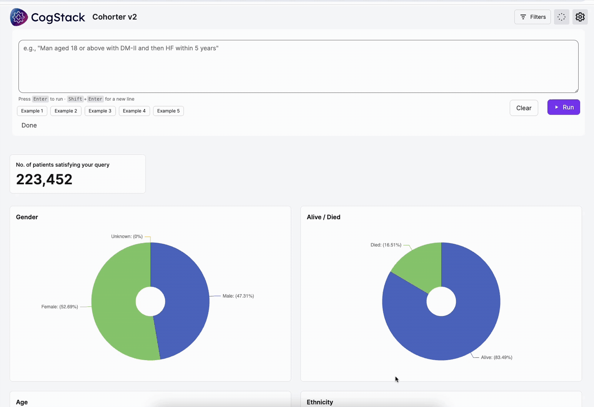

# CogStack Cohorter (MedCAT + NL2DSL + WebAPP)

A lightweight cohort discovery application that combines:
- **MedCAT** annotations API (clinical concept extraction)
- **NL2DSL** API (natural language → JSON cohort query via Ollama)
- **WebAPP** (frontend + backend for the full Cohorter experience)

**Live demo:** https://cogstackcohort.sites.er.kcl.ac.uk/



---

## Repository structure
- `NL2DSL/`  
  API service that accepts natural language queries, calls **Ollama** to translate them into a JSON DSL query, and uses MedCAT to normalize medical terms.

- `WebAPP/`  
  Full application (frontend + backend) providing the UI and orchestration of the workflow.

---

## Quick start (Docker Compose)

### Prerequisites
- Docker Desktop (or Docker Engine) with Docker Compose
- (Optional) GPU setup if you want Ollama GPU acceleration (depends on your host OS)

### 1) Build and start all services
From the repo root:

```bash
docker compose up --build
```

Or run in background:

```bash
docker compose up --build -d
```

### 2) Access the app
- Web UI: http://localhost:3000  
- MedCAT API: http://localhost:5000
- NL2DSL API: http://localhost:3002  
- Ollama: http://localhost:11434  

---

## Configuration

### NL2DSL environment variables (via docker-compose.yml)

NL2DSL uses:
- `OLLAMA_URL` (default in compose: `http://ollama:11434/api/generate`)
- `OLLAMA_MODEL` (default: `llama3.2:3b`)
- `MEDCAT_URL` (default: `http://cohorter-medcat:5000`)
- `ALLOW_ORIGINS` (default: `*`)

### WebAPP environment variables
WebAPP uses:
- `NL2DSL_URL` (default: `http://cohorter-nl2dsl:3002`)

### WebAPP random data generation (optional)
The `WebAPP/Dockerfile` supports a build arg `random` to generate random data:

```bash
WEBAPP_RANDOM=true docker compose up --build
```

(If you don’t need random data generation, keep it `false`.)

---

## Development

You can work on each component independently:

- `NL2DSL/` — API service (see its folder README)
- `WebAPP/` — Node app (server + client)

Each folder contains its own `Dockerfile` and scripts.

---

## Notes on models and licensing

- MedCAT model packs and any potentially sensitive data **must not** be committed to the repository.
- Ollama models are stored in a Docker named volume by default (`ollama:` in `docker-compose.yml`) so they persist across restarts.

---

## Troubleshooting

### Rebuild everything cleanly
```bash
docker compose down
docker compose up --build
```

### Remove Ollama downloaded models (if needed)
This deletes the named volume that stores Ollama models:

```bash
docker compose down -v
```

### Check logs
```bash
docker compose logs -f
```

---

## Acknowledgements
Built within the CogStack ecosystem to support clinical cohort discovery workflows.
