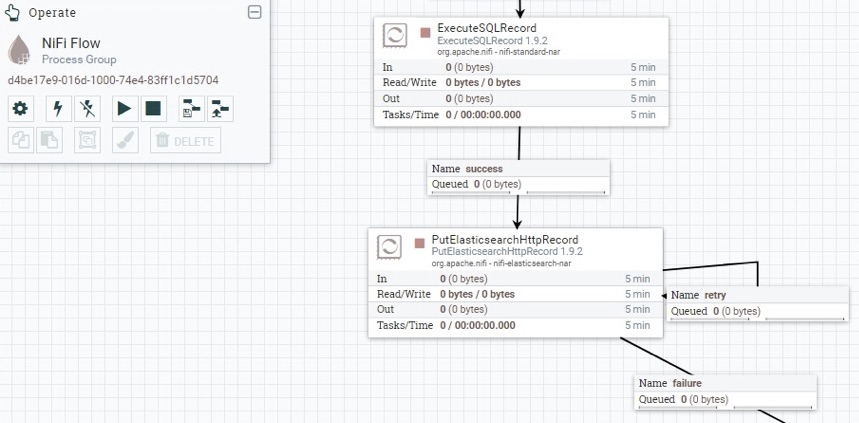

# Cogstack-NiFi

## What is Cogstack-NiFi

CogStack-NiFi is the re-architected version of CogStack-Pipeline that replaces the fixed Spring Batch-based pipeline engine with [Apache NiFi](https://nifi.apache.org/). It focuses on fully configurable and scalable data flows with the data processing engine that is easy to use, deploy and tailor to any site-specific data flow requirements. Apache NiFi also comes in with built-in monitoring, data provenance and security features that puts the operations in better control and reliability.

At its core, CogStack-NiFi handles the ingestion and harmonisation of data from disparate EHR sources — structured tables, unstructured free text, scanned documents requiring OCR — into a common, queryable format. It extracts, transforms, and loads this data into OpenSearch (or Elasticsearch) indices, and into structured SQL stores, ready for downstream NLP processing and search.

---

## Apache NiFi

*From the official documentation:* Apache NiFi is a dataflow system based on the concepts of flow-based programming. It supports powerful and scalable directed graphs of data routing, transformation, and system mediation logic. NiFi has a web-based user interface for design, control, feedback, and monitoring of dataflows. It is highly configurable along several dimensions of quality of service, such as loss-tolerant versus guaranteed delivery, low latency versus high throughput, and priority-based queuing. NiFi provides fine-grained data provenance for all data received, forked, joined cloned, modified, sent, and ultimately dropped upon reaching its configured end-state.

Some of the key features of Apache NiFi engine are:

- Highly configurable and extendable
    - Can build own data processors and modules that can be easily integrated into data pipeline
    - Enables rapid prototyping, development and effective testing
    - Data flows can be modified, inspected and troubleshot at runtime
- Web-based user interface
    - Seamless experience between design, control, feedback, and monitoring of the data flows
- Data Provenance
    - Can track data flow from beginning to end for addressing information governance requirements
- Security
    - Support for SSL, SSH, HTTPS, encrypted content, etc.
    - Multi-tenant authorization and internal authorization/policy management

For a detailed description of Apache NiFi, it's functionality and broad set of features please refer to links to the official documentation provided below.

---

## Useful links

[This guide](https://docs.cogstack.org/projects/nifi/en/latest/) containing the official documentation to Cogstack-Nifi is the next step, please take a look to learn in-depth about it, from introduction, to deploying!

**Cogstack-Nifi resources**

- Official documentation: [https://docs.cogstack.org/projects/nifi/en/latest/](https://docs.cogstack.org/projects/nifi/en/latest/)
- GitHub: [https://github.com/CogStack/CogStack-NiFi](https://github.com/CogStack/CogStack-NiFi)
- Documentation with deployment examples: [https://github.com/CogStack/CogStack-NiFi/tree/devel/deploy](https://github.com/CogStack/CogStack-NiFi/tree/devel/deploy)
- Documentation on available services: [https://github.com/CogStack/CogStack-NiFi/tree/devel/services](https://github.com/CogStack/CogStack-NiFi/tree/devel/services)
- DockerHub: [https://cloud.docker.com/repository/docker/cogstacksystems/cogstack-nifi](https://cloud.docker.com/repository/docker/cogstacksystems/cogstack-nifi)

**Apache NiFi resources**

- The official website: [https://nifi.apache.org/](https://nifi.apache.org/)
- The official documentation: [https://nifi.apache.org/docs.html](https://nifi.apache.org/docs.html)

---
### Example deployment and services

Please see [CogStack-NiFI example deployment with workflow examples](https://github.com/CogStack/CogStack-NiFi/tree/devel/deploy) .
